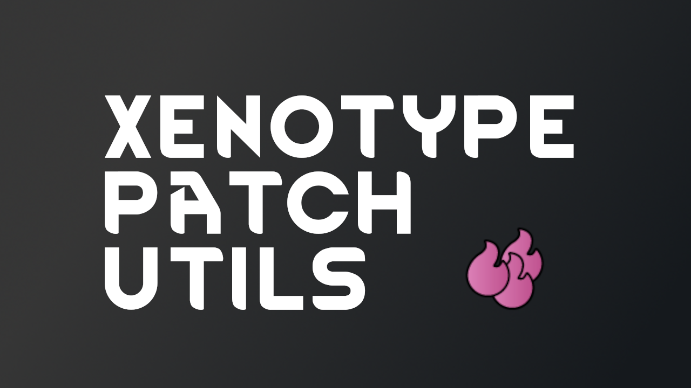

# Xenotype Patch Utils  

A RimWorld modding utility library for additional XML patch options on XenotypeDefs.

For more information, please see the [Steam workshop page](https://steamcommunity.com/sharedfiles/filedetails/?id=3474856773).
